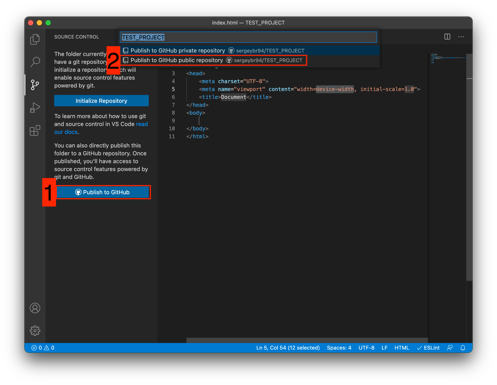

# ¿Qué es git? ¿Qué es git-Hub?

**Git** es una utilidad de consola para rastrear y mantener un historial de cambios en los archivos de su proyecto. La mayoría de las veces se usa para código, pero también se puede usar para otros archivos. Por ejemplo, para imágenes, útil para diseñadores.

Con **Git**, puedes revertir tu proyecto a una versión anterior, comparar, analizar o fusionar tus cambios en un repositorio.

Un repositorio es un repositorio de su código y el historial de sus cambios. **Git** se ejecuta localmente y todos sus repositorios se almacenan en carpetas específicas en su disco duro.

También puedes almacenar tus repositorios en Internet.

Cada punto de guardado de su proyecto se denomina **commit**. Cada **commit** tiene un **hash** (un **id** único) y un comentario. A partir de dichos **commit** se forma una rama. Una rama es una historia de cambios. Cada sucursal tiene su propio nombre. Un repositorio puede contener varias ramas que se crean a partir de otras ramas o se fusionan con ellas.

## Como funciona

Si miras la imagen, se vuelve un poco más fácil de entender. Cada círculo es un **commit**. Las flechas muestran la dirección desde la cual se **commit** el siguiente. Por ejemplo, _C3_ está hecho de _C2_, etc. Todas estas **commit** están en una rama llamada _main_. Esta es la rama principal, más a menudo llamada _master_. El rectángulo _main_ muestra en qué **commit** nos encontramos actualmente; en otras palabras, un puntero.


El resultado es un gráfico muy simple que consta de una rama (_main_) y cuatro **commit**. Todo esto puede convertirse en un gráfico más complejo, que consta de varias ramas que se fusionan en una.


## Instalación

Linux. Abra una terminal e ingrese el siguiente comando.

```Shell
# Debian или Ubuntu
sudo apt install git

# CentOS
sudo yum install git
```

## Ajustes

Has instalado Git y puedes usarlo.

```Shell
#Establece un nombre para tu usuario
#En lugar de <tu_nombre> puedes ingresar, por ejemplo, Grisha_Popov
#Deja las comillas
git config --global user.name "<tu_nombre>"

#Ahora configuremos el correo electrónico. El principio es el mismo.
git config --global user.email "<dirección_correo electrónico@correo electrónico.com>"
```

## Creando un repositorio

Ahora está listo para trabajar con Git localmente en su computadora.

Creemos nuestro primer repositorio. Para hacer esto, vaya a la carpeta de su proyecto.

```Shell
#Para Linux y MacOS, la ruta puede verse así: /Usuarios/Nombre de usuario/Desktop/MiProyecto
#Para Windows, por ejemplo С://MyProject
cd <ruta_a_su_proyecto>

#Inicializar/crear repositorio
git init
```

**Git** ahora rastrea los cambios en los archivos de su proyecto. Pero, como acaba de crear el repositorio, su código no está en él. Para hacer esto necesitas crear un **commit**.

```Shell
#Agregar todos los archivos del proyecto a nuestro compromiso futuro
git add .

#Más o menos
git add --all

#Si queremos agregar un archivo específico, podemos hacer esto
git add <nombre de archivo>

#Ahora creemos un compromiso. Asegúrese de incluir un comentario.
#Y no te olvides de las citas.
git commit -m "<comentario>"
```

Excelente. Creaste tu primer repositorio y lo llenaste con tu primera confirmación.

## Proceso de trabajo con Git

No deberías hacer una **commit** después de cada cambio de archivo. La mayoría de las veces se crean cuando:

- Nueva funcionalidad creada
- Se agregó un nuevo bloque al diseño.
- Errores de código corregidos
- Has completado tu jornada laboral y quieres guardar el código

Esto ayudará a mantener tus ramas limpias y ordenadas. Así, verás el historial de cambios de cada innovación de tu proyecto, y no de cada archivo.

## Creamos nuestro primer proyecto y lo publicamos en GitHub

Averigüemos cómo hacer esto usando el entorno de desarrollo Visual Studio Code (VS Code).

Antes de comenzar, te sugiero registrarte en **GitHub**.

Crea una carpeta donde se almacenará tu proyecto. Si dicha carpeta ya existe, no es necesario crear una nueva.

Luego abra VS Code.


1. Instale analizadores de código adicionales para JavaScript y PHP

2. Abra la carpeta que creó anteriormente

Después de esto tendrás una interfaz como esta.


1. Todos los archivos de su proyecto se ubicarán aquí
2. Aquí puedes trabajar con **Git**
3. Botón para crear un nuevo archivo
4. Botón para crear una nueva carpeta

Pasemos ahora al aporte para trabajar con **Git**.



Se abrirá la siguiente ventana:

1. Botón para publicar nuestro proyecto en **GitHub**
2. Después de hacer clic en el botón 1, aparecerá una ventana emergente. Debes seleccionar la segunda opción o donde esté presente la frase **...public repository**

Si desea crear un repositorio local y publicar el código en otro servicio, debe hacer clic en el botón Inicializar repositorio. Después de eso, seleccione manualmente el servicio donde publicar.

Después de haber seleccionado "Publicar un repositorio público en GitHub" (punto 2), el programa le pedirá que seleccione los archivos que se incluirán en la primera confirmación. Ponemos una marca de verificación en todos los archivos, si no están marcados, y hacemos clic en Aceptar. Serás redirigido al sitio web de GitHub, donde deberás confirmar el inicio de sesión de tu cuenta.

Ha creado y publicado un repositorio en GitHub.

Ahora haremos cambios en el código e intentaremos publicarlos nuevamente. Vaya a la pestaña de archivos, edite un archivo, no olvide presionar crtl+s (Windows) o cmd+s (MacOS) para guardar el archivo. Regrese a la pestaña de administración de Git.


Si miras el ícono de la pestaña **Git**, puedes ver el número 1 en un círculo azul. Significa cuántos archivos hemos cambiado y no confirmados. Comprometámoslo y publíquelo:

1. Botón para ver los cambios en el archivo. No es necesario hacer clic, indicado como referencia.
2. Agregue nuestro archivo para el futuro **commit**
3. Escribir un comentario
4. Crear un **commit**
5. Enviamos nuestro **commit** a **GitHub**

¡Felicitaciones, ha aprendido cómo crear un "compromiso" y enviarlo a **GitHub**!

---

# ¿Qué hace un archivo .gitignore?

El archivo **.gitignore**, es un archivo de texto que le dice a **Git** qué archivos o carpetas ignorar en un proyecto.

Un archivo local **.gitignore** generalmente se coloca en el directorio raíz de un proyecto. También puedes crear un archivo global **.gitignore**, y cualquier entrada en ese archivo se ignorará en todos tus repositorios de Git.

Para crear un archivo **.gitignore** local, crea un archivo de texto y asígnale el nombre "**.gitignore**" (recuerda incluir el . al principio). Luego, edita este archivo según sea necesario. Cada nueva línea debe incluir un archivo o carpeta adicional que quieras que **Git** lo ignore.

Las entradas de este archivo también pueden seguir un patrón coincidente:

- - se utiliza como una coincidencia comodín.
- / se usa para ignorar las rutas relativas al archivo .gitignore.
- \# es usado para agregar comentarios
  Este es un ejemplo de cómo puede lucir el archivo **.gitignore**:

```
# Ignora archivos del sistema Mac
.DS_store

# Ignora la carpeta node_modules
node_modules

# Ignora todos los archivos de texto
*.txt

# Ignora los archivos relacionados a API keys
.env

# Ignora archivos de configuración SASS
.sass-cache
```

Para agregar o cambiar tu **.gitignore** global, ejecuta el siguiente comando en la terminal:

```
git config --global core.excludesfile ~/.gitignore_global
```

Esto creará el archivo **~/.gitignore_global**. Ahora puedes editar ese archivo de la misma manera que un archivo **.gitignore** local. Todos tus repositorios Git ignorarán los archivos y carpetas listadas en el **.gitignore** global.
